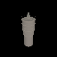

# 🪄 3D Mesh Generator

  
*Generate 3D models from text prompts with real-time preview*

## 🌟 Features
- **Text-to-3D** generation using AI models
- **Interactive 3D viewer** with orbit controls
- **OBJ export** 

### Prerequisites
- Python 3.9+
- Node.js 18+

### Local Setup
```bash
# Clone repository
git clone https://github.com/LenatThomas/Mesh-Generator.git
cd Mesh-Generator

# Backend setup (Flask)
pip install -r requirements.txt

# Frontend setup (Vite + Three.js)
cd Front/Viewer3D
npm install

# Terminal 1: Start backend (Flask)
cd Mesh-Generator/App
python app.py  # Runs on http://localhost:5000

# Terminal 2: Start frontend (Vite)
cd ../Front/Viewer3D
npm run dev  # Runs on http://localhost:5173
```
### Sample Input Output
#### Prompt: "A mini train"


#### Prompt: "A sword with neaon lights"


#### Prompt: "A dragonfly"


#### Prompt: "bookworm"


#### Prompt: "A tower with pointy roof"




### Interface 

A demo is provided in the outputs folder. outputs/Mesh View.mp4

Currently, only Shap-E is implemented. Support for additional models is planned, including models capable of refining a mesh based on a text prompt.
